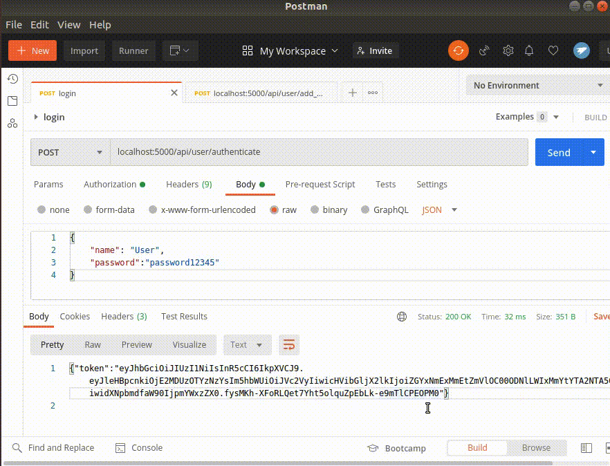
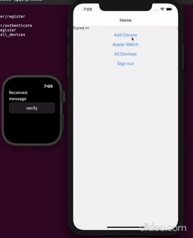

# Permission Based Two Factor Authentication

This repository was made to document a capstone project that was done over the span of 8 months. The authors of this project are Adam Iannaci and Dyllon Ngmon.

It was developed using the Go programming language, Swift, React-Native and a MySQL as the backend database.

# Concept

Our main concept behind creating this project was to enhance existing Two-Factor authentication. Two-Factor authentication is used today as an extra layer of security for users accounts across the web. One problem with Two-Factor authentication is if a user is successfull phished. If this occurs, an attacker is still able to gain access to the users account, regardless of the second factor needed.

Our concept takes advantage of a smart watch a user may own. Our PoC we developed uses the Apple Watch, but could be extended to work with other smart watches as well. The API we've developed adds a permission based scope to the Two-Factor authentication scheme.

# What is a Permission Based Scope?

The permission based scope we've developed here shows the user limited information depending on their verification levels. We've designed this to have 3 scopes:
* Users who are authenticated
* Users who are authenticated with a verified smart watch 
* Users who are unauthenticated

Depending on the scope the user has, certain information is diaplyed, or not displayed to the user. The reason this is implemented is because of what was described earlier. If an attacker is able to successfully phish a user, they are able to bypass the second factor of authentication and access all of the users information. With this scope, even if a user falls for a phishing attack, the attacker will not be able to view all of the users sensitive information (as long as they don't have access to the users physical smart watch).

# How it was Accomplished

We accomplished this by creating an API in Go which handles all of the requests for a user. The API has 10 endpoints:
* User registration
* User authentication
* Request password change (Forgot password)
* Verify security questions
* Change password
* Device registration
* Device verification
* All registered devices
* Web login
* Post web login

Once a user has registered by sending a POST request to the use registration endpoint, the user's record is inserted into the backend MySQL database, all sensitive information is salted and hashed using the SHA256 algorithm. Once a user is registered, in order to access many of the endpoints, they must use the provided JWT token that gets issued to them from the authentication endpoint. This token is used to ensure the user is who they say they are while they make the requests to the multiple endpoints.

The JWT token consists of:
* The expiry of the token
* The name of the user
* The users public id (generated during user registration with a random UUID)
* IoT value (true or false value determining whether a user has connected a smart watch to their account or not)

Having this this information stored in the JWT token enables the API to be able to query and insert records in the MySQL database depending on what endpoint is hit.

The following is a picture of the overall infrastructure to better show how everything works:

As can be observed, a laptop and the phone application would communicated with the Golang API through HTTP POSTs/GETs, depending on the request made, the Golang API will query the MySQL database. A key part of the smart watch verification process happens between the phone and smart watch communication. The phone will send the users JWT token over to the smart watch. Now, when a device is added to the users account, a random UUID value is generated for the public id of the smart watch just added. This UUID value is then physically stored on the smart watch to act as a CSRF token for the device verification process.

Once the UUID value is stored on the smart watch, the smart watch sends an HTTP POST to the Golang API. This POST request contains the UUID of the device that is being verified. This verification endpoint uses the users JWT token (that contains the user public id) to query the device connected to the users account and then compares the device public id in the database with the public id that's stored on the smart watch to ensure the request is coming from the correct device.

Once the smart watch is successfully verified, it will remained verified for 30 minutes. During the time in which the device is verified, a user is able to login to their account and view all of their personal informaiton. Once the verification has timed outthe users scope is reduced, and they are only able to view limited information when loggin into their account.

# Proof of Concept
The following will be a series of screenshots in order to demonstrate what was described is successfully working.

The first thing shown will be how a user would register a user account. To do this, they would send a POST request to the `/api/user/register` endpoint. This POST request must be sent with a JSON payload contianing a user's:
* Name
* Email
* Confirmation email
* Password
* Confirmation password
* 3 security questions
* 3 security question answers 

The following shows this exact process.

Once a user is registered, they must authorize themselves to be granted a JWT token. This token is used in the authorization header to gain access to the other endpoints in the API. For a user to login the must send a POST request to the `/api/user/authenticate` endpoint with their name and password in a JSON body. If the credentials match what's in the database, the user is granted their token.

Now, for the sake of demonstration purposes, let's say a user was to login to their account to view some of their personal informaiton. They would only be able to view limited information on their account because they have not added a smart watch to their account. They will only be able to view their:
* Name
* Public ID (UUID generated at time of registration)
* A True of False value, determining whether they have a smart watch connected to their account or not

The application will also instruct the user to add a smart device to their account if they would like to view all of their personal information.

.gif)

Once the user has their token, they can place it into the authorization header in order to make requsts to other endpoints. For example, when a user wants to add a smart watch to their account, they place their JWT token into the authorization header and send a POST request to the `/api/user/add_device` endpoint with the name of the device they would like to add as the body of the request. NOTE: This process would normally take place on the smart phone application (as demonstrated while showing the smart watch verification process).

Now, if a user was to login to view their account information they would see the same information they saw before. The only difference would be is the `Using IOT` value will have been updated from `False` to `True`. The message the application displays to the user will be slightly different too. It will now instruct the user to verify their smart device in order to access all of their personal information.

.gif)

Now, here's the process that would take place on the smart phone applciation and the smart watch in order verify the smart watch.

Now that the smart watch has been verified, when the user logs into the application, they will be able to view all of their personal information for 30 minutes. This information includes:
* Name
* Public ID
* Email
* A True of False value, determining whether they have a smart watch connected to their account or not
* 3 security questions (chosen during registration)

.gif)
